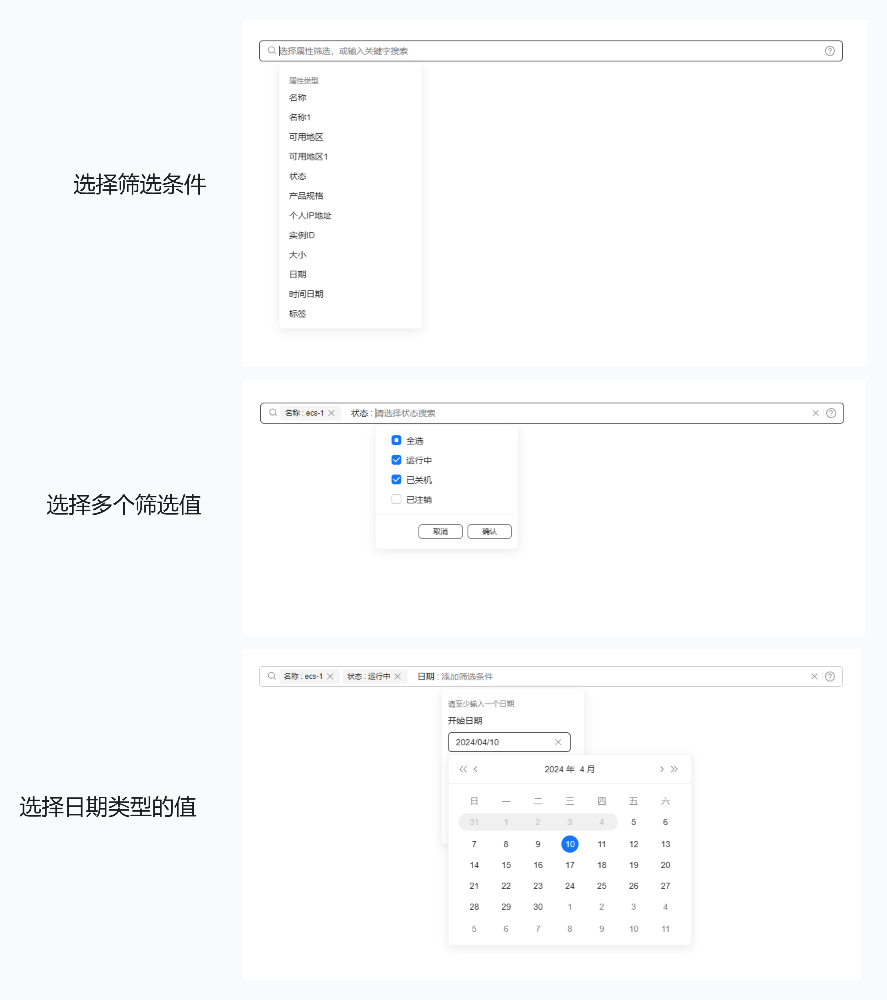

# TinySearchBox

TinySearchBox is a comprehensive search component based on Vue3. It uses the TinyVue component library and follows the OpenTiny design specifications. It is easy to use and powerful. It supports single selection, multiple selection, time, time range and so on.

English | [简体中文](README.zh-CN.md)

## Advantages

TinySearchBox has the following advantages:

- Gather the filtering criteria into one input box for higher filtering efficiency and a better user experience
- Supports multiple types of conditional filtering such as single selection, multiple selection, time, time interval, number size, and number interval
- Powerful search functions, supporting fuzzy search, custom search, etc.



## Quick Start

Install TinySearchBox:

```shell
npm i @opentiny/vue-search-box
```

Import TinySearchBox:

```javascript
import TinySearchBox from '@opentiny/vue-search-box';
```

Import styles:

```css
@import '@opentiny/vue-search-box/index.css';
```

html：

```html
<script setup>
  const tags = ref([]);
  const items = ref([
    {
      label: '名称',
      field: 'testName',
      replace: true,
      placeholder: '我是自定义名称的占位符',
      options: [
        {
          label: 'test-1'
        },
        {
          label: 'test-2'
        }
      ]
    },
    {
      label: '可用地区',
      field: 'testRegion',
      type: 'checkbox',
      mergeTag: true,
      placeholder: '我是自定义可选地区的占位符',
      editAttrDisabled: true, // 编辑状态此属性禁用，不可变更
      options: [
        {
          label: '华南区',
          id: '2-1'
        },
        {
          label: '华北区',
          id: '2-2'
        }
      ]
    },
    {
      label: '大小',
      field: 'size',
      type: 'numRange',
      placeholder: '我是自定义大小的占位符',
      unit: 'GB',
      start: -1,
      min: -1,
      max: 20
    }
  ]);
</script>

<template>
  <TinySearchBox v-model="tags" :items="items"></TinySearchBox>
</template>
```

## Development

```shell
git clone git@github.com:opentiny/tiny-search-box.git
cd tiny-search-box
pnpm i
pnpm dev
```

Open a browser to access：[http://localhost:5173/tiny-search-box/](http://localhost:5173/tiny-search-box/)

## License

[MIT](LICENSE)
