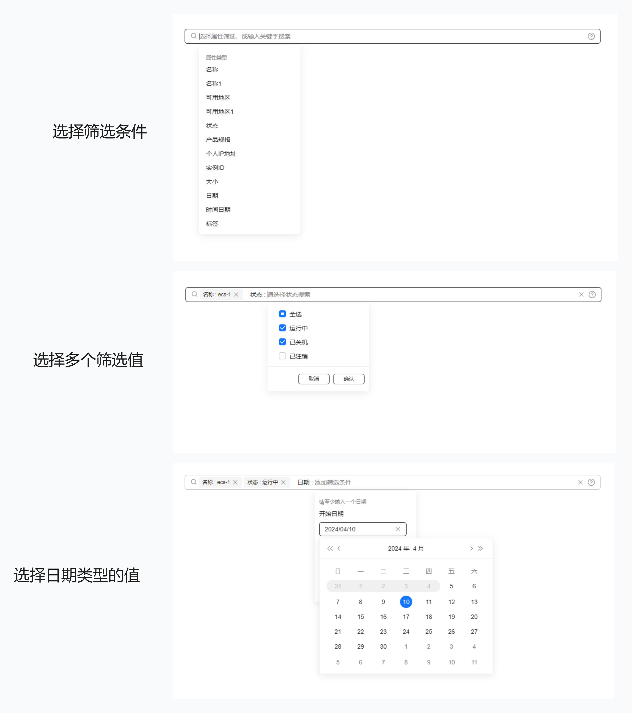

# TinySearchBox 综合搜索组件
<!-- ALL-CONTRIBUTORS-BADGE:START - Do not remove or modify this section -->
[](#contributors-)
<!-- ALL-CONTRIBUTORS-BADGE:END -->

TinySearchBox 是一个基于 Vue3 的综合搜索组件，使用 TinyVue 组件库，遵循 OpenTiny 设计规范，简单易用、功能强大，支持单选、多选、日期范围、日期时间范围、数字范围、键值、自定义、无值等多条件筛选。

[English](README.md) | 简体中文

## 项目优势

TinySearchBox 主要有以下特点和优势：

- 将筛选条件聚拢在一个输入框中，筛选效率更高、用户体验更好
- 支持单选、多选、日期范围、日期时间范围、数字范围、键值、自定义、无值等多种类型条件筛选
- 强大的搜索功能，支持模糊搜索、自定义搜索等



## 快速上手

安装 TinySearchBox

```shell
npm i @opentiny/vue-search-box
```

导入 TinySearchBox 综合搜索：

```javascript
import TinySearchBox from '@opentiny/vue-search-box';
```

组件包已内置样式文件，导入组件时会自动加载，**无需手动引入样式**。

在模板中使用：

```html
<script setup>
  const tags = ref([]);
  const items = ref([
    {
      label: '名称',
      field: 'testName',
      replace: true,
      placeholder: '我是自定义名称的占位符',
      options: [
        {
          label: 'test-1'
        },
        {
          label: 'test-2'
        }
      ]
    },
    {
      label: '可用地区',
      field: 'testRegion',
      type: 'checkbox',
      mergeTag: true,
      placeholder: '我是自定义可选地区的占位符',
      editAttrDisabled: true, // 编辑状态此属性禁用，不可变更
      options: [
        {
          label: '华南区',
          id: '2-1'
        },
        {
          label: '华北区',
          id: '2-2'
        }
      ]
    },
    {
      label: '大小',
      field: 'size',
      type: 'numRange',
      placeholder: '我是自定义大小的占位符',
      unit: 'GB',
      start: -1,
      min: -1,
      max: 20
    }
  ]);
</script>

<template>
  <tiny-search-box v-model="tags" :items="items"></tiny-search-box>
</template>
```

## 本地开发

```shell
git clone git@github.com:opentiny/tiny-search-box.git
cd tiny-search-box
pnpm install:all
pnpm dev
```

打开浏览器访问：[http://localhost:5173/tiny-search-box/](http://localhost:5173/tiny-search-box/)

## License

[MIT](LICENSE)

## Contributors ✨

Thanks goes to these wonderful people ([emoji key](https://allcontributors.org/docs/en/emoji-key)):

<!-- ALL-CONTRIBUTORS-LIST:START - Do not remove or modify this section -->
<!-- prettier-ignore-start -->
<!-- markdownlint-disable -->
<table>
  <tbody>
    <tr>
      <td align="center" valign="top" width="12.5%"><a href="https://github.com/chenxi-20"><br /><sub><b>chenxi-20</b></sub></a><br /><a href="https://github.com/opentiny/tiny-search-box/commits?author=chenxi-20" title="Code">💻</a></td>
      <td align="center" valign="top" width="12.5%"><a href="https://kagol.github.io/blogs"><br /><sub><b>Kagol</b></sub></a><br /><a href="https://github.com/opentiny/tiny-search-box/commits?author=kagol" title="Code">💻</a></td>
      <td align="center" valign="top" width="12.5%"><a href="https://github.com/zzcr"><br /><sub><b>ajaxzheng</b></sub></a><br /><a href="https://github.com/opentiny/tiny-search-box/commits?author=zzcr" title="Code">💻</a></td>
      <td align="center" valign="top" width="12.5%"><a href="https://github.com/discreted66"><br /><sub><b>liukun</b></sub></a><br /><a href="https://github.com/opentiny/tiny-search-box/commits?author=discreted66" title="Code">💻</a></td>
      <td align="center" valign="top" width="12.5%"><a href="https://github.com/liangguanhui0117"><br /><sub><b>LiangGuanhui</b></sub></a><br /><a href="https://github.com/opentiny/tiny-search-box/commits?author=liangguanhui0117" title="Code">💻</a></td>
      <td align="center" valign="top" width="12.5%"><a href="https://github.com/sf-think"><br /><sub><b>murphy</b></sub></a><br /><a href="https://github.com/opentiny/tiny-search-box/commits?author=sf-think" title="Code">💻</a></td>
    </tr>
  </tbody>
</table>

<!-- markdownlint-restore -->
<!-- prettier-ignore-end -->

<!-- ALL-CONTRIBUTORS-LIST:END -->

This project follows the [all-contributors](https://github.com/all-contributors/all-contributors) specification. Contributions of any kind welcome!